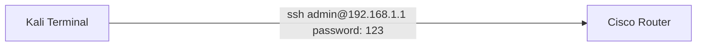

<link rel="stylesheet" href="/assets/js/xterm/xterm.css">

```mermaid
    flowchart LR
    K["Kali Terminal"]
    R["Cisco Router"]

    K -------------->|ssh admin@192.168.1.1 password: 123| R
```

  

